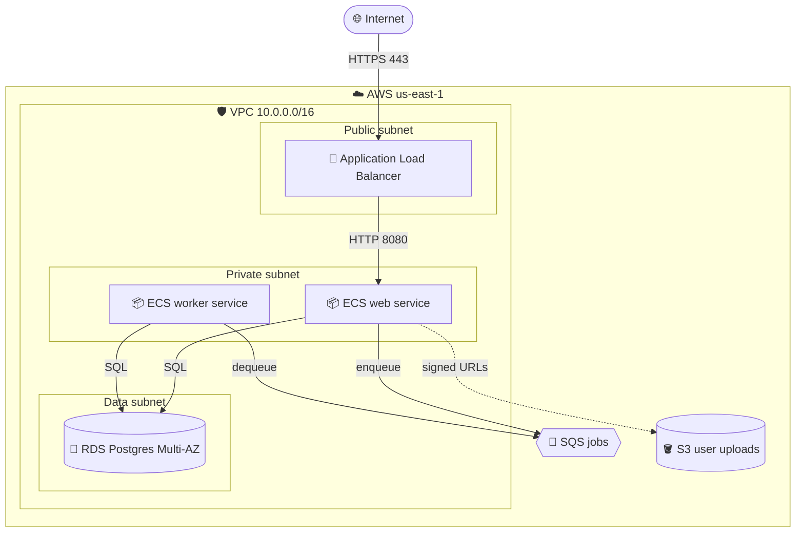

# Example: Three-tier web app on AWS

**Prompt the user gave:** *"Draw me a three-tier web app on AWS with an ALB, two ECS services (web + worker), and an RDS Postgres backend."*

**Response:**

**Design notes:**

- **Why two ECS services and not one?** Long-running background work (image resize, email, exports) needs its own scaling profile and shouldn't share CPU with request-serving containers.
- **RDS Multi-AZ** for automatic failover — single-AZ is fine for dev/test but rarely acceptable in production for a three-tier app.
- **Uploads bypass the API** via S3 pre-signed URLs to avoid a 100 MB file streaming through ECS containers.
- **No NAT gateway shown** — add one (or VPC endpoints) if the private subnet containers need to reach S3/SQS over the AWS network without a public IP.

**Want to extend?** Common follow-ups: add CloudFront in front of ALB, add ElastiCache Redis for sessions, add WAF rules, split into multi-region active/passive.
