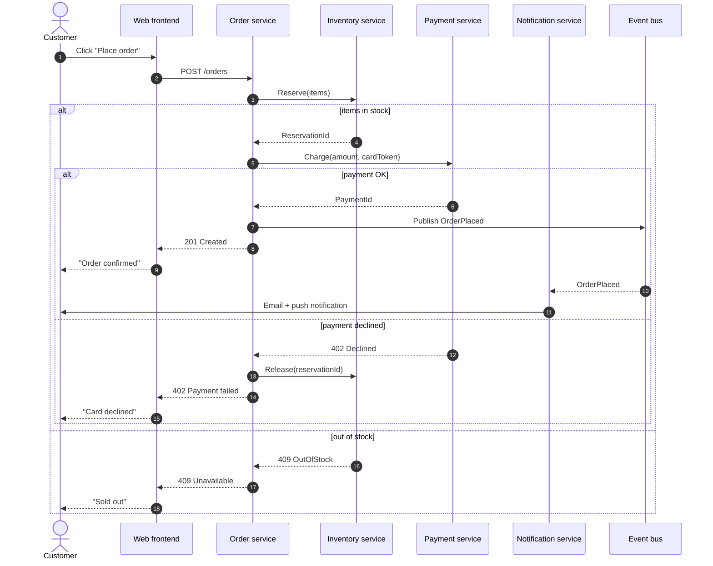

# Example: Order placement across microservices

**Prompt the user gave:** *"Show me the sequence of calls when a customer places an order — we have an Order service, an Inventory service, a Payment service, and a Notification service."*

**Response:**

**Design notes:**

- **Two-step inventory** (reserve → confirm) avoids the classic race where two customers buy the last unit between stock-check and charge.
- **Compensating action** (`Release`) on payment failure — explicit in the diagram so reviewers can spot the rollback gap if it's missing.
- **Notification is async** (event bus, dashed line) — slow email shouldn't block the customer's response.
- **`autonumber`** makes every step referenceable in design-review comments ("what happens at step 8?").
