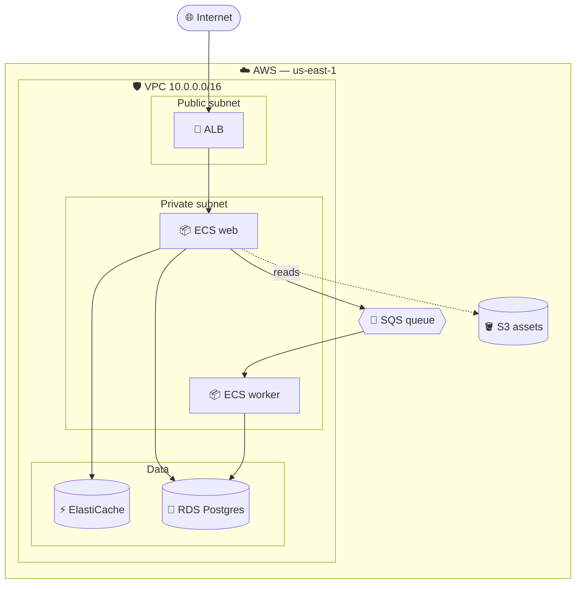

# AWS-flavoured Mermaid starter

Mermaid doesn't ship native AWS icons, but emojis + clear naming get you 80% of the visual clarity for free, and the diagram still renders anywhere Markdown does.

## Service → emoji cheat sheet

| Service | Emoji | Service | Emoji |
|---|---|---|---|
| EC2 / ECS / Fargate | 📦 | RDS / Aurora | 🐘 |
| Lambda | λ or ⚡ | DynamoDB | 🗄️ |
| S3 | 🪣 | ElastiCache | ⚡ |
| ALB / NLB / API GW | 🔀 | CloudFront | 🌍 |
| SQS / SNS | 📨 | EventBridge | 🚌 |
| Cognito / IAM | 🔐 | KMS | 🔑 |
| Route 53 | 🧭 | CloudWatch | 📊 |

## Tips

- Use `subgraph` to make VPC → subnet → service nesting visible — it's the single biggest readability win.
- Mark public vs private subnets explicitly.
- Dotted arrows (`-.label.->`) for async / read-only / observability paths so the primary request path stays prominent.
- For multi-region, draw one region in detail and a thin "replica" box for the others, with a labeled arrow between them.
