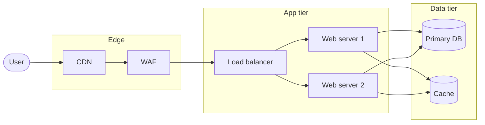

# Mermaid flowchart starter

Use for: boxes-and-arrows structural diagrams. Top-down (`TD`) reads like a deployment stack; left-right (`LR`) reads like a request flow.

## Tips

- `[Box]` rectangle · `([Stadium])` user/external · `[(Cylinder)]` database · `{Diamond}` decision · `>Flag]` event
- Use `&` to fan-out from one source to many destinations: `LB --> Web1 & Web2 & Web3`
- Use `subgraph Name["Display label"]` to draw zones (VPC, account, region)
- Annotate links with `--label-->` to name the arrow
- Pick *one* direction (`TD`, `LR`) per diagram; mixing kills readability
