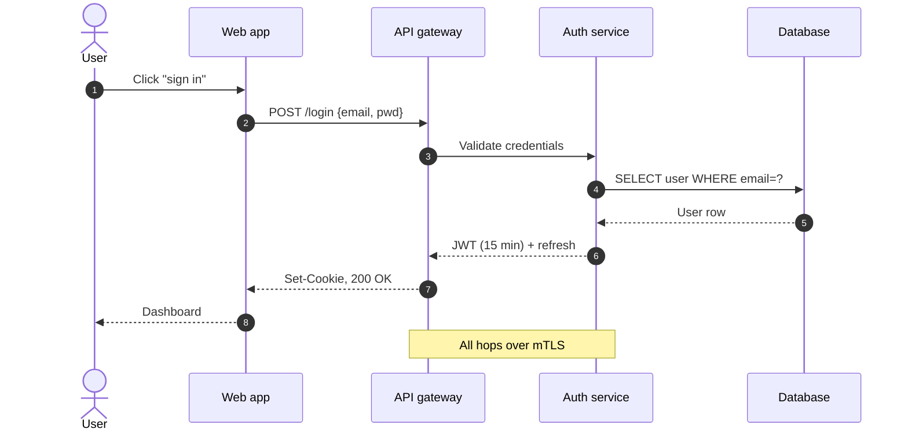

# Mermaid sequence diagram starter

Use for: showing the **order** of messages between participants. Best when "who calls whom in what order" is the question.



## Tips

- `->>` solid arrow (call) · `-->>` dashed arrow (return/async) · `-x` lost message
- `autonumber` adds 1, 2, 3 to each step — great for design reviews
- `Note over A,B: text` annotates a span; `Note left of A: text` annotates one side
- `loop`, `alt`/`else`, `par` for control flow:
  ```
  alt token valid
      API-->>Web: 200
  else token expired
      API-->>Web: 401
  end
  ```
- Don't overuse — past ~12 messages it becomes a wall. Split into "happy path" and "error path" diagrams.
