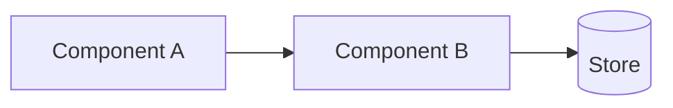

# {Title — what we're building, as a noun phrase}

| Field | Value |
|---|---|
| Status | {Draft / In Review / Approved / Implemented} |
| Author(s) | {Names} |
| Reviewers | {Names — list the people whose approval you need} |
| Date | {YYYY-MM-DD} |
| Related | {Links to ADRs, prior design docs, tickets} |

## TL;DR

- {One bullet — what we're doing}
- {One bullet — why now}
- {One bullet — what changes for callers / users}

## Context

{Two or three paragraphs. What's the current state? What's the forcing function? Why is this design doc happening *now* rather than 6 months ago or in 6 months?}

## Goals

- {Goal — measurable where possible: "p99 latency under 100ms"}
- {Goal}
- {Goal}

## Non-goals

- {Non-goal — something a reasonable reader might assume is in scope but isn't, e.g. "migrating existing customers' historical data"}
- {Non-goal}

## Proposal

{The actual design. This is the largest section. Cover:}

### High-level architecture

{Embed a Mermaid or PlantUML diagram showing the major components and data flow. Keep it under 15 nodes.}

### Key design decisions

- **{Decision 1}:** {What we chose and the one-line why.}
- **{Decision 2}:** {What we chose and the one-line why.}
- **{Decision 3}:** {What we chose and the one-line why.}

### API / interface

{For each new or changed endpoint, show a small example. Don't dump the OpenAPI spec — point to it instead.}

### Data model changes

{Schema changes, migrations needed, backfill plan.}

## Alternatives considered

### {Alternative 1}

{2–3 sentences: what it is, why we didn't pick it.}

### {Alternative 2}

{2–3 sentences.}

## Risks & mitigations

| Risk | Likelihood | Impact | Mitigation |
|---|---|---|---|
| {Risk — e.g. "migration script takes longer than the maintenance window"} | M | H | {Mitigation — e.g. "rehearse on prod-shape staging; have a no-op rollback path"} |
| {Risk} | L | H | {Mitigation} |

## Rollout plan

1. **{Phase} — {behind feature flag, internal only}:** {Concrete criteria for advancing to next phase, e.g., "no new errors in error budget for 48h"}
2. **{Phase} — {1% of traffic}:** {Criteria}
3. **{Phase} — {10% / 50% / 100%}:** {Criteria}

**Rollback criteria:** {When do we revert? Be specific.}

## Observability

- **New metrics:** {what we'll instrument}
- **New alerts:** {pages on what conditions}
- **Dashboard:** {link, or "TBD before launch"}

## Open questions

- **{Question}** — owner: {name}, due: {date}
- **{Question}** — owner: {name}, due: {date}

## Appendix

{Optional — link out to longer materials. Don't inline. Common contents: benchmarks, full schema diffs, security review notes.}
